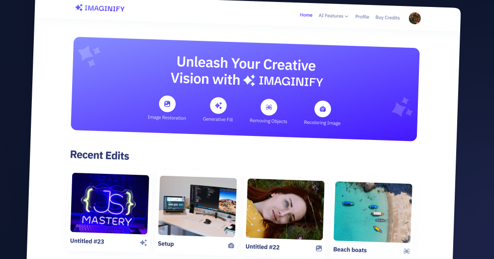

<div align="center">
  <br />
    <a href="https://youtu.be/Ahwoks_dawU?feature=shared" target="_blank">
      
    </a>
  <br />

  <div>
    
    
    
    
    
  </div>

  <h3 align="center">An AI SaaS Platform</h3>
</div>

## 📋 <a name="table">Table of Contents</a>

1. 🤖 [Introduction](#introduction)
2. ⚙️ [Tech Stack](#tech-stack)
3. 🔋 [Features](#features)
4. 🤸 [Quick Start](#quick-start)

## <a name="introduction">🤖 Introduction</a>

An AI based SaaS platform that excels in image processing capabilities, integrates a secure payment infrastructure, offers advanced image search functionalities, and supports multiple AI features, including image restoration, recoloring, object removal, generative filling, and background removal.

## <a name="tech-stack">⚙️ Tech Stack</a>

- Next.js
- TypeScript
- MongoDB
- Clerk
- Cloudinary
- Stripe
- Shadcn
- TailwindCSS

## <a name="features">🔋 Features</a>

- **Authentication and Authorization**
- **Community Image Showcase**
- **Advanced Image Search**
- **Image Restoration**
- **Image Recoloring**
- **Image Generative Fill**
- **Object Removal**
- **Background Removal**
- **Download Transformed Images**
- **Transformed Image Details**
- **Transformation Management**
- **Credits System**
- **Profile Page**
- **Credits Purchase**
- **Responsive UI/UX**

and many more, including code architecture and reusability 

## <a name="quick-start">🤸 Quick Start</a>

Follow these steps to set up the project locally on your machine.

**Prerequisites**

Make sure you have the following installed on your machine:

- [Git](https://git-scm.com/)
- [Node.js](https://nodejs.org/en)
- [npm](https://www.npmjs.com/) (Node Package Manager)

**Cloning the Repository**

```bash
git clone https://github.com/darkrajeshow/imaginify.git
cd imaginify
```

**Installation**

Install the project dependencies using npm:

```bash
npm run dev
```

**Set Up Environment Variables**

Create a new file named `.env.local` in the root of your project and add the following content:

```env
#NEXT
NEXT_PUBLIC_SERVER_URL=

#MONGODB
MONGODB_URL=

#CLERK
NEXT_PUBLIC_CLERK_PUBLISHABLE_KEY=
CLERK_SECRET_KEY=
WEBHOOK_SECRET=

NEXT_PUBLIC_CLERK_SIGN_IN_URL=/sign-in
NEXT_PUBLIC_CLERK_SIGN_UP_URL=/sign-up
NEXT_PUBLIC_CLERK_AFTER_SIGN_IN_URL=/
NEXT_PUBLIC_CLERK_AFTER_SIGN_UP_URL=/

#CLOUDINARY
NEXT_PUBLIC_CLOUDINARY_CLOUD_NAME=
CLOUDINARY_API_KEY=
CLOUDINARY_API_SECRET=

#STRIPE
STRIPE_SECRET_KEY=
STRIPE_WEBHOOK_SECRET=
NEXT_PUBLIC_STRIPE_PUBLISHABLE_KEY=
```

Replace the placeholder values with your actual respective account credentials. You can obtain these credentials by signing up on the [Clerk](https://clerk.com/), [MongoDB](https://www.mongodb.com/), [Cloudinary](https://cloudinary.com/) and [Stripe](https://stripe.com)

**Running the Project**

```bash
npm run dev
```

Open [http://localhost:3000](http://localhost:3000) in your browser to view the project.
